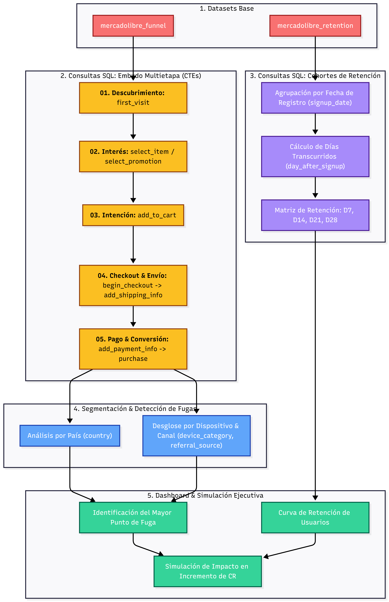
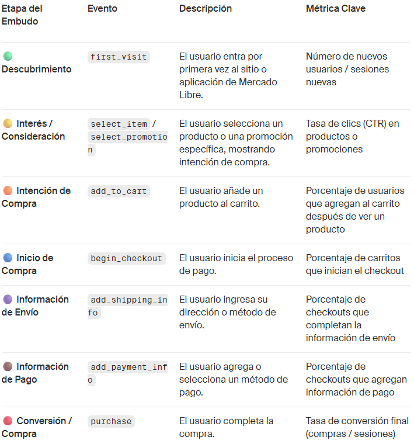
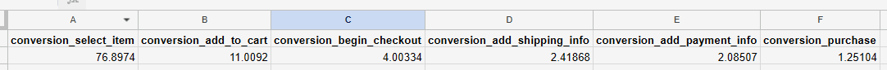
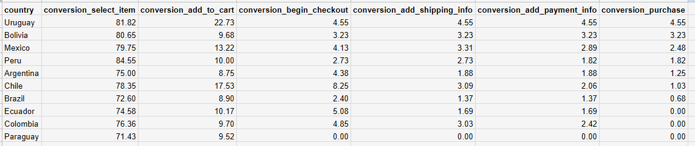
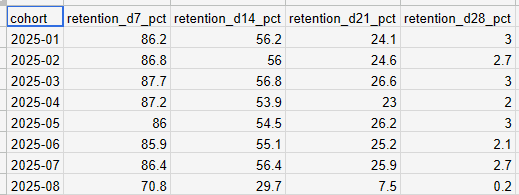
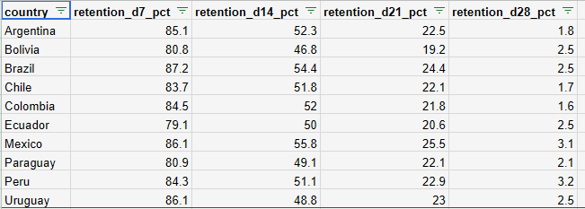

# 🛒 Análisis SQL de Embudo de Conversión & Retención por Cohortes (MercadoLibre)

> El objetivo de este proyecto es exhibir el **dominio técnico en SQL (PostgreSQL / BigQuery)** mediante expresiones de tabla comunes (CTEs), funciones de ventana y agregaciones complejas para mapear el *Macro Journey* del usuario, identificar puntos de fuga (*drop-off*) y evaluar la retención longitudinal (D7, D14, D21, D28) en la plataforma.

---

## 🎯 Objetivo del Proyecto
Mapear el embudo de conversión completo de 7 etapas para **MercadoLibre** (desde `first_visit` hasta `purchase`), aislando las caídas procentuales por país, dispositivo y canal de tráfico. Adicionalmente, se construye un modelo de cohortes de retención para usuarios registrados entre el 01/01/2025 y el 06/01/2025, proyectando simulaciones de impacto de negocio tras optimizar el *checkout*.

---

## 🛠️ Tecnologías y Métodos Analíticos
* **SQL Avanzado:** Common Table Expressions (CTEs) multinivel, agregaciones condicionales (`COUNT(DISTINCT CASE WHEN...)`), agrupaciones dinámicas y pivoteo de datos.
* **Métricas de Producto & Funnels:** Tasa de Conversión (CR) paso a paso, Drop-off Rate, Análisis por Dispositivo (`mobile`, `desktop`, `tablet`) y Fuente de Tráfico (`organic`, `paid_search`, `social`).
* **Análisis de Cohortes (Retention Analytics):** Medición de actividad recurrente a D7, D14, D21 y D28 desde la fecha de registro (`signup_date`).
* **Python / BI (Visualización):** Generación de curvas de retención y diagramas de embudo ejecutivo.

---

## 📐 Arquitectura del Flujo Analítico en SQL

---

📊 Visualizaciones Clave e Insights
1. Embudo Global de Conversión (Macro Journey)Punto de Deserción Crítico (Churn Point):
   El cuello de botella principal ocurre entre select_item y add_to_cart, donde el paso cae de un $76.89\%$ a solo $11.00\%$ (una tasa de abandono del $85.6\%$).
   Insight: Cerca de 9 de cada 10 usuarios que demuestran interés en un producto abandonan la navegación antes de agregarlo al carrito. Este representa el mayor costo de oportunidad de la plataforma.

2. Desglose del Embudo de Conversión por País
  Comportamiento Regional: La caída en add_to_cart se mantiene homogénea en la mayoría de los mercados ($75\% - 80\%$ de abandono).
  Casos Atípicos Exitosos: Uruguay y Bolivia presentan un desempeño extraordinario del $100\%$ de efectividad constante en las fases finales del flujo (begin_checkout $\rightarrow$ add_shipping_info $\rightarrow$ add_payment_info $\rightarrow$ purchase).
  Anomalía Técnica: En Paraguay, tras el paso add_to_cart, el porcentaje de conversión cae a $0\%$, lo que sugiere un fallo técnico/operativo o un bloqueo en la integración del carrito hacia el checkout.

3. Matriz de Retención por Cohorte de Registro (D7 - D28)
   Comportamiento Histórico (Enero - Julio 2025): Muestra un compromiso inicial muy sólido que se degrada drásticamente hacia el final del mes:
     Día 7 (D7): $86.5\%$ (Excelente retención inicial).
     Día 14 (D14): $55.4\%$ (Retención moderada).
     Día 21 (D21): $25.1\%$ (Punto de fuga crítico).
     Día 28 (D28): $2.7\%$ (Lealtad residual).
   Anomalía en Cohorte 2025-08: Se registra un colapso en el engagement desde la entrada; la retención a D7 cae al $70.8\%$ (un $15\%$ a $25\%$ menos que el promedio histórico) y se desploma a $0.2\%$ en D28.
   

4. Curvas de Retención Longitudinal por Mercado/País
   Mercados Eficientes: México ($3.1\%$) y Perú ($3.2\%$) lideran en retención residual a D28.
   Mercados Ineficientes: Colombia y Chile retienen únicamente el $1.9\%$ al final del mes.
   Fuga Acelerada en Uruguay: Aunque presenta excelente retención inicial en D7 ($86.1\%$), pierde a más de la mitad de sus usuarios activos hacia D14.
   
   
---

##💡 Recomendaciones Estratégicas y de Producto
1.🛍️ Optimización de Ficha de Producto (select_item $\rightarrow$ add_to_cart):
  Realizar auditorías de UX/UI en el botón de compra/carrito.
  Revisar transparencia en costos de envío, disponibilidad de stock y visibilidad de valoraciones/reseñas para reducir la fricción antes de la decisión de compra.

2.🚨 Intervención Técnica Urgente en Paraguay e IT Audit en Cohorte 08:
  Paraguay: Enviar reporte técnico prioritario a los equipos de IT/Logística para resolver la interrupción que impide a los usuarios avanzar desde el carrito hacia el checkout.
  Cohorte Agosto 2025: Investigar cambios recientes en despliegues de software (releases), campañas de adquisición de tráfico de baja calidad o fallos de infraestructura ocurridos durante dicho periodo.

3. 🔁 Estrategia de Re-engagement antes del Día 21:
  Diseñar campañas automatizadas (Push Notifications, Email Marketing personalizado, cupones de recompra) entre el D14 y D21 para reactivar el interés del usuario antes de que caiga al nivel de retención residual del D28.

4.🌎 Replicación de Prácticas Regionales:
  Estudiar los factores que impulsan la efectividad del checkout en Uruguay y Bolivia para replicar sus flujos simplificados en mercados con menor conversión.

---

📂 Contenido del Repositorio

/notebooks/: Jupyter Notebook para la ejecución, visualización y simulación de escenarios de optimización.

/docs/assets/: Diagramas de arquitectura y capturas del análisis de cohortes.
